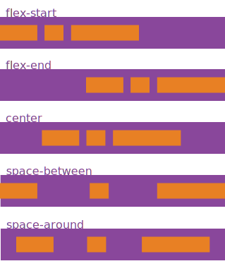
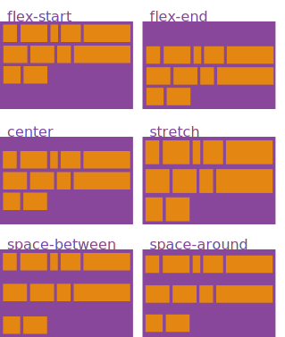

class: middle, center

# CSS Flexbox

---

## CSS3 Flexible Box module
      
The **CSS3 Flexible Box**, or **flexbox**, is a layout mode providing for the arrangement of elements on a page such that the elements behave predictably when the page layout must accommodate different screen sizes and different display devices. 

For many applications, the flexible box model provides an improvement over the block model in that it does not use floats, nor do the flex container's margins collapse with the margins of its contents.

---

## Flexbox concept
      
#### The defining aspect of the flex layout is the ability to alter its items' width and/or height to best fill the available space on any display device. A flex container expands items to fill available free space, or shrinks them to prevent overflow.

The flexbox layout algorithm is direction-agnostic as opposed to the block layout, which is vertically-biased, or the inline layout, which is horizontally-biased. 

While the block layout works well for pages, it lacks sufficient definition to support application components that have to change orientation, resize, stretch, or shrink as the user agent changes, flips from vertical to horizontal, and so forth. 

---

## Flexible boxes vocabulary
      
#### While a discussion of flexible boxes is liberated from terms like horizontal/inline axis and vertical/block axis, it requires a new terminology to properly describe the model. 


---

## Flexible boxes vocabulary

**Flex container**
      
The parent element in which flex items are contained. A flex container is defined using the `flex` or `inline-flex` values of the display property.

**Flex item**

Each child of a flex container becomes a flex item. Text directly contained in a flex container is wrapped in an anonymous flex item.

---

## Flexible boxes vocabulary

**Axes**

Every flexible box layout follows two axes. The main axis is the axis along which the flex items follow each other. The cross axis is the axis perpendicular to the main axis.

- The `flex-direction` property establishes the main axis.

- The `justify-content` property defines how flex items are laid out along the main axis on the current line.

- The `align-items` property defines the default for how flex items are laid out along the cross axis on the current line.

- The `align-self` property defines how a single flex item is aligned on the cross axis, and overrides the default established by align-items.

---

## Flexible boxes vocabulary

**Directions**

The **main start/main end** and **cross start/cross end** sides of the flex container describe the origin and terminus of the flow of flex items. They follow the main axis and cross axis of the flex container in the vector established by the writing-mode (left-to-right, right-to-left, etc.).

- The `order` property assigns elements to ordinal groups and determines which elements appear first.

- The `flex-flow` property shorthands the `flex-direction` and `flex-wrap` properties to lay out the flex items.

**Lines**

Flex items can be laid out on either a single line or on several lines according to the `flex-wrap` property, which controls the direction of the cross axis and the direction in which new lines are stacked.

---

## Flexible boxes vocabulary

**Dimensions**

The flex items' agnostic equivalents of height and width are main size and cross size, which respectively follow the main axis and cross axis of the flex container.

- The `min-height` and `min-width` properties initial value is 0.

- The `flex` property shorthands the `flex-grow`, `flex-shrink`, and `flex-basis` properties to establish the flexibility of the flex items.

---

## Properties for the parent (container)

**display**

This defines a flex container; inline or block depending on the given value. It enables a flex context for all its direct children.

```css
.container {
  display: flex; /* or inline-flex */
}
```

---

## Properties for the parent (container)

**flex-direction**
      
This establishes the main-axis, thus defining the direction flex items are placed in the flex container. Flexbox is (aside from optional wrapping) a single-direction layout concept. Think of flex items as primarily laying out either in horizontal rows or vertical columns.

```css
.container {
  flex-direction: row;
}
```
row | row-reverse | column | column-reverse


---

## Properties for the parent (container)

**flex-wrap**

By default, flex items will all try to fit onto one line. You can change that and allow the items to wrap as needed with this property. Direction also plays a role here, determining the direction new lines are stacked in.

```css
.container{
  flex-wrap: nowrap;
}
```
nowrap | wrap | wrap-reverse


---

## Properties for the parent (container)

**flex-flow (Applies to: parent flex container element)**

This is a shorthand flex-direction and flex-wrap properties, which together define the flex container's main and cross axes. Default is row nowrap.

```css
.container{
  flex-flow: <‘flex-direction’> || <‘flex-wrap’>
}
```

---

## Properties for the parent (container)

**justify-content**

This defines the alignment along the main axis. It helps distribute extra free space left over when either all the flex items on a line are inflexible, or are flexible but have reached their maximum size. It also exerts some control over the alignment of items when they overflow the line.

```css
.container {
  justify-content: flex-start;
}
```
flex-start | flex-end | center | space-between | space-around
- **flex-start** (default): items are packed toward the start line

- **flex-end**: items are packed toward to end line

- **center**: items are centered along the line

- **space-between**: items are evenly distributed in the line; first item is on the start line, last item on the end line

- **space-around**: items are evenly distributed in the line with equal space around them. Note that visually the spaces aren't equal, since all the items have equal space on both sides. The first item will have one unit of space against the container edge, but two units of space between the next item because that next item has its own spacing that applies.

---

## Properties for the parent (container)

**justify-content**

This defines the alignment along the main axis. It helps distribute extra free space left over when either all the flex items on a line are inflexible, or are flexible but have reached their maximum size. It also exerts some control over the alignment of items when they overflow the line.



---

## Properties for the parent (container)

**align-items**

This defines the default behaviour for how flex items are laid out along the cross axis on the current line. Think of it as the justify-content version for the cross-axis (perpendicular to the main-axis).

```css
.container {
  align-items: flex-start;
}
```
flex-start | flex-end | center | baseline | stretch

- **flex-start**: cross-start margin edge of the items is placed on the cross-start line

- **flex-end**: cross-end margin edge of the items is placed on the cross-end line

- **center**: items are centered in the cross-axis

- **baseline**: items are aligned such as their baselines align

- **stretch** (default): stretch to fill the container (still respect min-width/max-width)

---

## Properties for the parent (container)

**align-items**

This defines the default behaviour for how flex items are laid out along the cross axis on the current line. Think of it as the justify-content version for the cross-axis (perpendicular to the main-axis).


---

## Properties for the parent (container)

**align-content**

This aligns a flex container's lines within when there is extra space in the cross-axis, similar to how justify-content aligns individual items within the main-axis. 

```css
.container {
  align-content: stretch;
}
```
flex-start | flex-end | center | space-between | space-around | stretch

- **flex-start**: lines packed to the start of the container

- **flex-end**: lines packed to the end of the container

- **center**: lines packed to the center of the container

- **space-between**: lines evenly distributed; the first line is at the start of the container while the last one is at the end

- **space-around**: lines evenly distributed with equal space around each line

- **stretch** (default): lines stretch to take up the remaining space

---

## Properties for the parent (container)

**align-content**

This aligns a flex container's lines within when there is extra space in the cross-axis, similar to how justify-content aligns individual items within the main-axis. 



---

## Properties of the children (items)

**order**

By default, flex items are laid out in the source order. However, the order property controls the order in which they appear in the flex container.

```css
.item {
  order: <integer>;
}
```


---

## Properties of the children (items)

**flex-grow**

This defines the ability for a flex item to grow if necessary. It accepts a unitless value that serves as a proportion. It dictates what amount of the available space inside the flex container the item should take up.

If all items have `flex-grow` set to 1, the remaining space in the container will be distributed equally to all children. If one of the children a value of 2, the remaining space would take up twice as much space as the others (or it will try to, at least).

```css
.item {
  flex-grow: <number>; /* default 0 */
}
```


---

## Properties of the children (items)

**flex-shrink**

This defines the ability for a flex item to shrink if necessary.

```css
.item {
  flex-shrink: <number>; /* default 1 */
}
```

**flex-basis**

This defines the default size of an element before the remaining space is distributed. It can be a length (e.g. 20%, 5rem, etc.) or a keyword. The auto keyword means "look at my width or height property" (which was temporarily done by the main-size keyword until deprecated). 

The content keyword means "size it based on the item's content" - this keyword isn't well supported yet, so it's hard to test and harder to know what it's brethren max-content, min-content, and fit-content do.
```css
.item {
  flex-basis: <length> | auto; /* default auto */
}
```

If set to 0, the extra space around content isn't factored in. If set to auto, the extra space is distributed based on its flex-grow value. See this graphic.

---

## Properties of the children (items)

**flex**

This is the shorthand for `flex-grow`, `flex-shrink` and `flex-basis` combined. The second and third parameters (flex-shrink and flex-basis) are optional. Default is 0 1 auto.

```css
.item {
  flex: none | [ <'flex-grow'> <'flex-shrink'>? || <'flex-basis'> ]
}
```

It is recommended that you use this shorthand property rather than set the individual properties. The short hand sets the other values intelligently. 

---

## Properties of the children (items)

**align-self**

This allows the default alignment (or the one specified by `align-items`) to be overridden for individual flex items.

Please see the `align-items` explanation to understand the available values.
```css
.item {
  align-self: auto;
}
```
auto | flex-start | flex-end | center | baseline | stretch


---

## Flexbox Resources

- [W3Schools](http://www.w3schools.com/css/css3_flexbox.asp)
- [Using CSS flexible boxes](https://developer.mozilla.org/en-US/docs/Web/CSS/CSS_Flexible_Box_Layout/Using_CSS_flexible_boxes)
- [A Visual Guide to CSS3 Flexbox Properties](https://scotch.io/tutorials/a-visual-guide-to-css3-flexbox-properties)
- [A Complete Guide to Flexbox](https://css-tricks.com/snippets/css/a-guide-to-flexbox/)
- [Flexbox Cheatsheet](http://jonibologna.com/flexbox-cheatsheet/)
- [Flexbox playground](http://codepen.io/enxaneta/full/adLPwv/)
- [Flexbox froggy](http://flexboxfroggy.com/)
