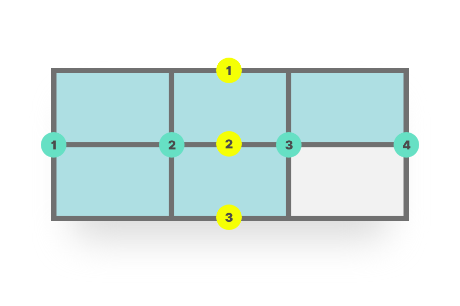
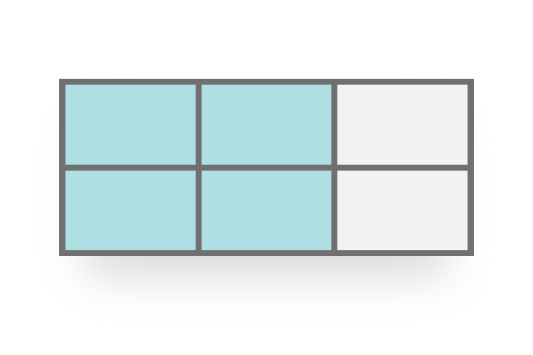
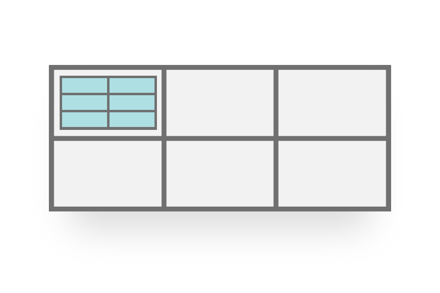
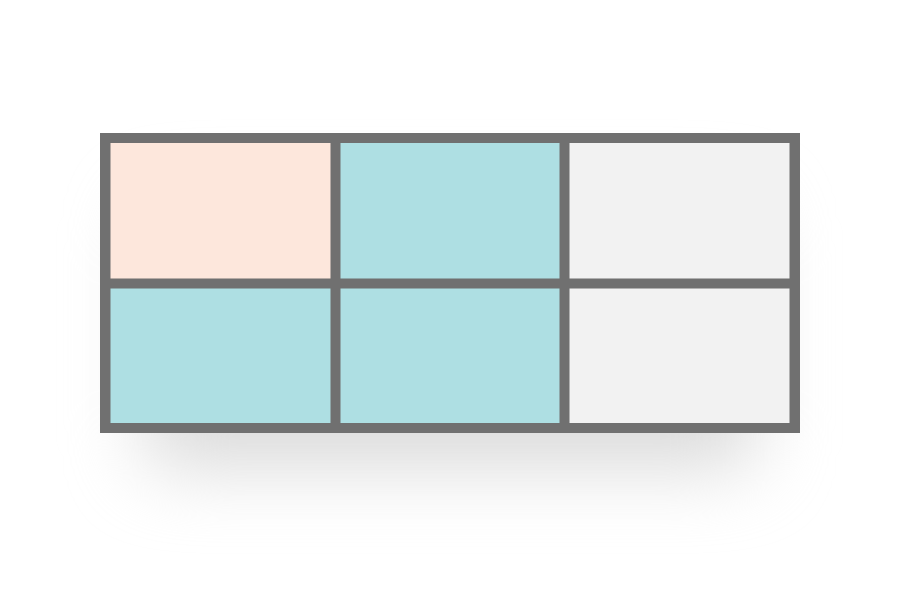

class: middle, center

# CSS Grid Layout

---

##CSS Grid Layout
      
**CSS Grid layout** excels at dividing a page into major regions, or defining the relationship in terms of size, position, and layer, between parts of a control built from HTML primitives.

Like tables, grid layout enables an author to align elements into columns and rows. However, many more layouts are either possible or easier with CSS grid than they were with tables. For example, a grid container's child elements could position themselves so they actually overlap and layer, similar to CSS positioned elements.

---

##What is a grid?
      
####A grid is an intersecting set of horizontal and vertical lines – one set defining columns and the other rows. Onto the grid elements can be placed respecting these column and row lines. CSS grid layout has the following features:

**Fixed and flexible track sizes**

You can create a grid with fixed track sizes – using pixels for example. You can also create a grid using flexible sizes with percentages or with the new fr unit designed for this purpose.

**Item placement**

You can place items into a precise location on the grid using line numbers, names or by targeting an area of the grid. Grid also contains an algorithm to control the placement of items not given an explicit position on the grid.

---

 ##What is a grid?
      
**Creation of additional tracks to hold content**

You can define an explicit grid with grid layout but the specification also deals with content added outside of a declared grid, adding additional rows and columns as needed. Features such as adding “as many columns as will fit into a container” are included.

**Alignment control**

Grid contains alignment features in order that we can control how items align once placed into a grid area, and how the entire grid is aligned.

**Control of overlapping content**
      
More than one item can be placed into a grid cell, or areas can partially overlap each other. This layering may then be controlled with **z-index**.

Grid is a powerful specification and when combined with other parts of CSS such as **flexbox**, can help you to create layouts that were previously impossible to build in CSS. It all starts by creating a grid on your grid container.


---

##The Grid container
      
We create a grid container by declaring **display: grid** or **display: inline-grid** on an element. As soon as we do this all direct children of that element will become grid items.

```css
.container {
* display: grid;
}
```

Values:

- **grid** - generates a block-level grid
- **inline-grid** - generates an inline-level grid
- **subgrid** - if your grid container is itself a grid item (i.e. nested grids), you can use this property to indicate that you want the sizes of its rows/columns to be taken from its parent rather than specifying its own.


---

##Grid Tracks

We define rows and columns on our grid with the **grid-template-columns** and **grid-template-rows** properties. These define grid tracks. A grid track is the space between any two lines on the grid. In the below image you can see a track highlighter – the first row track in our grid.

```css
.container {
  display: grid;
* grid-template-columns: 200px 200px 200px;
}
```

Values:

- `<track-size>` - can be a length, a percentage, or a fraction of the free space in the grid (using the fr unit)
- `<line-name>` - an arbitrary name of your choosing

---

##The fr Unit
      
Tracks can be defined using any length unit. Grid also introduces an additional length unit to help us create flexible grid tracks. The new **fr** unit represents a fraction of the available space in the grid container. The next grid definition would create three equal width tracks that grow and shrink according to the available space.

```css
.container {
  display: grid;
* grid-template-columns: 1fr 1fr 1fr;
}
```

**Track listings with repeat() notation**

Large grids with many tracks can use **repeat()** notation to repeat all or a section of the track listing. For example the grid definition:

```css
.container {
  display: grid;
* grid-template-columns: repeat(3, 1fr);
}
```

---

##Implicit and explicit grid

When the rows are created as needed for the content, they are created in the implicit grid. The explicit grid consists of the rows and columns you define with **grid-template-columns** and **grid-template-rows**. If you place something outside of that defined grid, or due to the amount of content more grid tracks are needed, then grid creates rows and columns in the implicit grid. These tracks will be auto-sized by default, so will size based on the content inside them.

You can also define a set size for tracks created in the implicit grid with the grid-auto-rows and grid-auto-columns properties.

```css
.container {
  display: grid;
  grid-template-columns: repeat(3, 1fr);
* grid-auto-rows: 200px;
}
```

---

##Track sizing and minmax()
      
When setting up an explicit grid or defining the sizing for automatically created rows or columns we may want to give tracks a minimum size, but ensure they expand to fit any content that is added. For example, I may want my rows to never collapse smaller than 100 pixels, but if my content stretches to 300 pixels in height I would like the row to stretch to that height.

Grid has a solution for this with the **minmax()** function. In this next example I am using minmax() in the value of **grid-auto-rows**. Automatically created rows will be a minimum of 100 pixels tall, and a maximum of auto. Using *auto* means that the size will look at the content size and so stretch to give space for the tallest thing in a cell in this row.

```css
.container {
  display: grid;
  grid-template-columns: repeat(3, 1fr);
* grid-auto-rows: minmax(100px, auto);
}
```

---

##Grid Lines
      
It should be noted that when we define a grid we define the grid tracks, not the lines. Grid then gives us numbered lines to use when positioning items. 

In our three column, two row grid we have four column lines.

.half[]

---

##Positioning items against lines

Using the values: 
- **grid-column-start**
- **grid-column-end**
- **grid-row-start**
- **grid-row-end**

Determines a grid item's location within the grid by referring to specific grid lines. grid-column-start/grid-row-start is the line where the item begins, and grid-column-end/grid-row-end is the line where the item ends.

Values:

- `<line>` - can be a number to refer to a numbered grid line, or a name to refer to a named grid line
- `span <number>` - the item will span across the provided number of grid tracks
- `span <name>` - the item will span across until it hits the next line with the provided name
- `auto` - indicates auto-placement, an automatic span, or a default span of one

---

##Positioning items against lines


```css
.item-a {
  grid-row-start: row1-start;
  grid-row-end: 3;
  grid-column-start: 2;
  grid-column-end: five;
}
```

.small[]

---

##The grid-column and grid-row shorthands
      
The **grid-column-start** and **grid-column-end** properties can be combined into **grid-column**, **grid-row-start** and **grid-row-end** into **grid-row**.

```css
.item-a {
  grid-row-start: 1;
  grid-row-end: 3;
  grid-column-start: 2;
  grid-column-end: 5;
}
```

Becomes:

```css
.item-a {
  grid-row: 1 / 3;
  grid-column: 2 / 5;
}
```

---

##The grid-area property

We can take things a step further and define each area with a single property – **grid-area**. The order of the values for grid-area are as follows.

- grid-row-start
- grid-column-start
- grid-row-end
- grid-column-end

```css
.item-a {
  grid-area: 1 / 2 / 3 / 5;
}
```

---

##Using the span keyword
      
In addition to specifying the start and end lines by number, you can specify a start line and then the number of tracks you would like the area to span.

```css
.item-a {
  grid-row: 1 / span 2;
}
```

You can also use the span keyword in the value of **grid-row-start** and **grid-column-start**.


---

##Grid Cells
      
A grid cell is the smallest unit on a grid, conceptually it is like a table cell. As we saw in our earlier examples, once a grid is defined on a parent the child items will lay themselves out once in each cell of the defined grid. In the below image I have highlighted the first cell of the grid.

.half[]

---

##Grid Areas

Items can span one or more cells both by row or by column, and this creates a grid area. Grid areas have to be rectangular – it isn’t possible to create an L-shaped area for example. The highlighted grid area spans two row and two column tracks.

.half[]

---

##Gutters (Gap)

Gutters or alleys between grid cells can be created using the **grid-column-gap** and **grid-row-gap** properties, or the shorthand **grid-gap**.

```css
.container {
  display: grid;
  grid-template-columns: repeat(3, 1fr);
* grid-column-gap: 10px;
* grid-row-gap: 1em;
}
```

Any space used by gaps will be accounted for before space is assigned to flexible length fr tracks, and gaps act for sizing purposes like a regular grid track, however you cannot place anything into a gap. In terms of line-based positioning, the gap acts like a fat line.


---

##Grid Gap shorthand

The two properties can also be expressed as a shorthand, **grid-gap**. If you only give one value for grid-gap it will apply to both column and row gaps. If you specify two values, the first is used for **grid-row-gap** and the second for **grid-column-gap**.

```css
.container {
  display: grid;
  grid-template-columns: repeat(3, 1fr);
* grid-gap: 1em 10px;
}
```

---

##Nesting grids

A grid item can become a grid container.

.half[]

---

##Layering items with `z-index`

Grid items can occupy the same cell.

.half[]

You can use `z-index` to control their stacking order.

---

##grid-auto-flow
      
The grid-auto-flow CSS property controls how the auto-placement algorithm works, specifying exactly how auto-placed items get flowed into the grid.

```css
.container {
  display: grid;
* grid-auto-flow: row;
}
```

Values:

- **row** - Is a keyword specifying that the auto-placement algorithm places items, by filling each row in turn, adding new rows as necessary. If neither row nor column is provided, row is assumed.
- **column** - Is a keyword specifying that the auto-placement algorithm places items, by filling each column in turn, adding new columns as necessary.
- **dense** -     Is a keyword specifying that the auto-placement algorithm uses a “dense” packing algorithm, which attempts to fill in holes earlier in the grid, if smaller items come up later. This may cause items to appear out-of-order, when doing so would fill in holes left by larger items.
- If it is omitted, a “sparse” algorithm is used, where the placement algorithm only ever moves “forward” in the grid when placing items, never backtracking to fill holes. This ensures that all of the auto-placed items appear “in order”, even if this leaves holes that could have been filled by later items.


---

##Naming Grid Lines

Grid lines can be named when defining the grid with the **grid-template-rows** and **grid-template-columns** properties. Line names can then be referenced to position grid items.

```css
.container {
  grid-template-rows:    [row-1-start] 1fr [row-2-start] 1fr [row-2-end];
  grid-template-columns: [col-1-start] 1fr [col-2-start] 1fr [col-2-end];
}
```

Assign names to grid lines when defining your grid with the **grid-template-rows** and **grid-template-columns** properties.

In line names, avoid keywords that appear in the specification (e.g. span) to not cause confusion.

Assigned line names must be wrapped in square brackets **[name-of-line]** and placed relative to the grid tracks.

---

##Positioning Items by Line Names
      
With named grid lines, items can be positioned by line names and numbers.

```css
.item {
  grid-row-start:    row-2-start;
  grid-row-end:      row-end;
  grid-column-start: col-2-start;
  grid-column-end:   col-end;
}
```

```css
.item {
  grid-row:    row-2-start / row-end;
  grid-column: col-2-start / col-end;
}
```
---
####Naming and Positioning Items by Grid Lines with the Same Name

Lines can be assigned the same name with the **repeat()** function. This can save you time from having to name each line in track definitions.

```css
.container {
  grid-template-rows: repeat(3, [row-start] 1fr [row-end]);
  grid-template-columns: repeat(3, [col-start] 1fr [col-end]);
}
```

Line name assignments can also be included within the **repeat()** function. This results in multiple grid lines with the same names.

Lines with the same name are also assigned the line’s position/name’s occurrence number, which allows it to be uniquely identified from another line with the same name.

To position items by lines with the same name, reference the line’s name and position/name’s occurrence number—the name and number should be separated by a whitespace.
      
```css
.container {
  grid-row:    row-start 2 / row-end 3;
  grid-column: col-start / col-start 3;
}
```

---

##Naming and Positioning Items by Grid Areas

Like grid line names, grid areas can also be named with the **grid-template-areas** property. Names can then be referenced to position grid items.

```css
.container {
  grid-template-areas:   "header header"
                          "content sidebar"
                          "footer footer";
  grid-template-rows:    150px 1fr 100px;
  grid-template-columns: 1fr 200px;
}
```
Sets of names should be surrounded in single or double quotes, and each name separated by a whitespace.

Each set of names defines a row, and each name defines a column.

---
##Naming and Positioning Items by Grid Areas
      
Grid area names can be referenced by the same properties to position grid items: **grid-row-start**, **grid-row-end**, **grid-column-start**, and **grid-column-end**.

```css
.header {
  grid-row-start:    header;
  grid-row-end:      header;
  grid-column-start: header;
  grid-column-end:   header;
}
```

The **grid-row** and **grid-column** shorthand properties can also reference grid area names.

```css
.footer {
  grid-row:    footer;
  grid-column: footer;
}
```

The **grid-area** shorthand property can also be used to reference grid area names.
    
```css
.sidebar {
  grid-area: sidebar;
}
```
---

##Aligning Grid Items

**CSS’s Box Alignment Module** complements **CSS Grid** to allow items to be aligned along the row of column axis.

**justify-items** and **justify-self** align items along the row axis, and **align-items** and **align-self** align items along the column axis.

**justify-items** and **align-items** are applied to the grid container and support the following values:
      
- auto
- normal
- start
- end
- center
- stretch
- baseline
- first baseline
- last baseline

---

##Aligning Grid Items

Alignment applied to the grid container:

```css
.container {
  justify-items: start;
  align-items: start;
}
```

Alignment applied to the grid item:

```css
. item {
  justify-self: start;
  align-self: start;
}
```

---

##Aligning Grid Tracks
      
Grid tracks can be aligned relative to the grid container along the row and column axes.

**align-content** aligns tracks along the row axis and **justify-content** along the column axis. They support the following properties:
      
- normal
- start
- end
- center
- stretch
- space-around
- space-between
- space-evenly
- baseline
- first baseline
- last baseline

Columns are aligned at the center of the row axis.
Rows are aligned at the end of the column axis.

```css
.grid {
  justify-content: center;
  align-content: end;
}
```

---

##Taking care of browsers

Where you do need to overwrite CSS used for older browsers, you can do so inside a CSS Feature Query. This enables safe encapsulation of any CSS you only want a grid supporting browser to apply.

If you float an item, in your CSS for non-grid browsers, when that item becomes a grid item float ceases to have any effect. The clear property applied to an item that becomes a grid item also no longer takes effect.

```css
.grid > div {
  float: left;
}

.grid {
  display: grid;
  grid-gap: 10px;
  grid-template-columns: repeat(3, auto);
  width: 500px;
}

```
- Float and clear have no effect on a grid item
- Items set to inline-block become grid items
- Flex items become grid items - and box alignment properties still apply

---

##Taking care of browsers
      
- A width applied in the fallback layout may have unintended consequences.

```css
.grid > div {
  float: left;
  width: 33.333%;
}

@supports (display: grid) {
  .grid > div {
    width: auto;
  }
}

.grid {
  display: grid;
  grid-gap: 10px;
  grid-template-columns: repeat(3, 1fr);
  width: 500px;
}

```

---

####CSS Grid Layout Resources
- [CSS Grid Layout Module](https://drafts.csswg.org/css-grid/)
- [CSS Grid Layout](https://developer.mozilla.org/en-US/docs/Web/CSS/CSS_Grid_Layout)
- [Learn CSS Grid](http://learncssgrid.com/)
- [Learning CSS Grids](http://varun.ca/css-grid/)
- [An introduction to CSS Grid](http://www.lottejackson.com/learning/an-intro-to-css-grid)
- [A Complete Guide to Grid](https://css-tricks.com/snippets/css/complete-guide-grid/)
- [Spring Into CSS Grid](http://jonibologna.com/spring-into-css-grid/)

####Tools/Games
- [Grid Garden](https://cssgridgarden.com/)
- [Griddy](http://griddy.io/)

####Fallbacks
- [Grid “fallbacks” and overrides](https://rachelandrew.co.uk/css/cheatsheets/grid-fallbacks)
- [Using Feature Queries in CSS](https://hacks.mozilla.org/2016/08/using-feature-queries-in-css)

####CSS Box Alignment
- [CSS Box Alignment Module ](https://drafts.csswg.org/css-align/)
