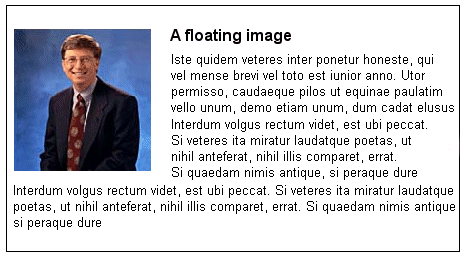

class: middle, center

# CSS Positioning

---

## CSS Positioning

CSS Positioning is a module of CSS that defines how to absolutely and relavitely position elements on the page.

The CSS specification offers us **five** position properties: 
- static
- relative
- absolute
- fixed
- inherit
      
Each property serves a specific purpose. 

Understanding that purpose is the key to mastering CSS-based layouts.

- [CSS Positioning 101](http://alistapart.com/article/css-positioning-101)
- [CSS Tricks - position](https://css-tricks.com/almanac/properties/p/position/)

---

## `position` property

A **positioned element** is an element whose computed position property is either:
- relative
 
 A **relatively positioned element** is an element whose computed position property is relative.
- absolute

 An **absolutely positioned element** is an element whose computed position property is absolute or fixed.
- sticky

 A **stickily positioned element** is an element whose computed position property is sticky.
- fixed

The top, right, bottom, and left properties specify the position of positioned elements.

---

## `position` syntax

```css
div {
  /* Keyword values */
  position: static;
  position: relative;
  position: absolute;
  position: fixed;
  position: sticky;

  /* Global values */
  position: inherit;
  position: initial;
  position: unset;
}
```

---

## `position: static`

This keyword lets the element use the normal behavior, that is it is laid out in its current position in the flow.  

The top, right, bottom, left and z-index properties do not apply.


---

## `position: relative`

This keyword lays out all elements as though the element were not positioned, and then adjust the element's position, without changing layout (and thus leaving a gap for the element where it would have been had it not been positioned). 

The effect of position:relative on table-*-group, table-row, table-column, table-cell, and table-caption elements is undefined.


---

## `position: absolute`

Does not leave space for the element. 

Instead, position it at a specified position relative to its **closest positioned ancestor** or **to the containing block**.

Absolutely positioned boxes can have margins, they do not collapse with any other margins.


---

## `position: fixed`

Does not leave space for the element. 

Instead, position it at a specified position relative to the screen's viewport and don't move it when scrolled. 

When printing, position it at that fixed position on every page. 

This value always creates a new stacking context.


---

## `position: sticky`

The box position is calculated according to the normal flow (this is called the position in normal flow). 

Then the box is offset relative to its flow root and containing block and in all cases, including table elements, does not affect the position of any following boxes. 

When a box B is stickily positioned, the position of the following box is calculated as though B were not offset. 

The effect of ‘position: sticky’ on table elements is the same as for ‘position: relative’.

<iframe height="250" style="width: 100%;" scrolling="no" title="CSS Position: Sticky" src="//codepen.io/geoffgraham/embed/ybVzeX/?height=300&theme-id=35867&default-tab=html,result" frameborder="no" allowtransparency="true" allowfullscreen="true">
  See the Pen <a href='https://codepen.io/geoffgraham/pen/ybVzeX/'>CSS Position: Sticky</a> by Geoff Graham
  (<a href='https://codepen.io/geoffgraham'>@geoffgraham</a>) on <a href='https://codepen.io'>CodePen</a>.
</iframe>

[Can I use...](https://caniuse.com/#feat=css-sticky)


---

## `top`, `right`, `bottom`, `left` properties

The top, right, bottom, and left properties specify the position of positioned elements.

They have no effect on non-positioned elements.

```css
div {
  position: relative;
  top: 20px;
  left: 20px;
}
```

For absolutely positioned elements (those with position: absolute or position: fixed), it specifies the distance between the top margin edge of the element and the top edge of its containing block.

For relatively positioned elements (those with position: relative), it specifies the amount the element is moved below its normal position.

When both top and bottom are specified, as long as height is unspecified, auto or 100%, both top and bottom distances will be respected. Otherwise, if height is constrained in any way, the top property takes precedence and the bottom property is ignored.

---

## `float` property

The float CSS property specifies that an element should be taken from the normal flow and placed along the left or right side of its container, where text and inline elements will wrap around it.

A floating element is one where the computed value of float is not none.





---

## `float` property values


```css
div {
  float: left;
}
```
Left is a keyword indicating that the element must float on the left side of its containing block.

```css
div {
  float: right;
}
```
Right is a keyword indicating that the element must float on the right side of its containing block.

```css
div {
  float: none;
}
```
None is a keyword indicating that the element must not float.

---

## clearing the `float`

The simplest way to clear the floats in this example is to add the clear property to the new element we want to be sure is aligned left.

```css
clear: none;
clear: left;
clear: right;
clear: both;
```

**none** is a keyword indicating that the element is not moved down to clear past floating elements.

**left** is a keyword indicating that the element is moved down to clear past left floats.

**right** is a keyword indicating that the element is moved down to clear past right floats.

**both** is a keyword indicating that the element is moved down to clear past both left and right floats.
---

##`visibility` property

The visibility property can be used to hide an element while leaving the space where it would have been. It can also hide rows or columns of a table.

```css
visibility: visible;
```


**visible**

Default value, the box is visible.

**hidden**

The box is invisible (fully transparent, nothing is drawn), but still affects layout.  Descendants of the element will be visible if they have visibility:visible (this doesn't work in IE up to version 7).

**collapse**

For table rows, columns, column groups, and row groups the row(s) or column(s) are hidden and the space they would have occupied is removed (as if display: none were applied to the column/row of the table). 

However, the size of other rows and columns is still calculated as though the cells in the collapsed row(s) or column(s) are present. 

This was designed for fast removal of a row/column from a table without having to recalculate widths and heights for every portion of the table. For other elements, collapse is treated the same as hidden. 

---

## `z-index` property

The **z-index** property specifies the z-order of an element and its descendants. When elements overlap, z-order determines which one covers the other. An element with a larger z-index generally covers an element with a lower one.

For a positioned box, the z-index property specifies:

The stack level of the box in the current stacking context.
Whether the box establishes a local stacking context.

```css
/* Keyword value */
z-index: auto;

/* <integer> values */
z-index: 0;
z-index: 3;
z-index: 289;
```
---

## `z-index` values

**auto**

The box does not establish a new local stacking context. The stack level of the generated box in the current stacking context is the same as its parent's box.

**integer**
  
This integer is the stack level of the generated box in the current stacking context.


[Positioning](http://blog.froont.com/positioning-in-web-design/)

---

## Resources

- http://codepen.io/jwncoexists/pen/nybar

- http://www.w3schools.com/css/css_positioning.asp

- http://learnlayout.com/position.html

- https://css-tricks.com/almanac/properties/p/position/
