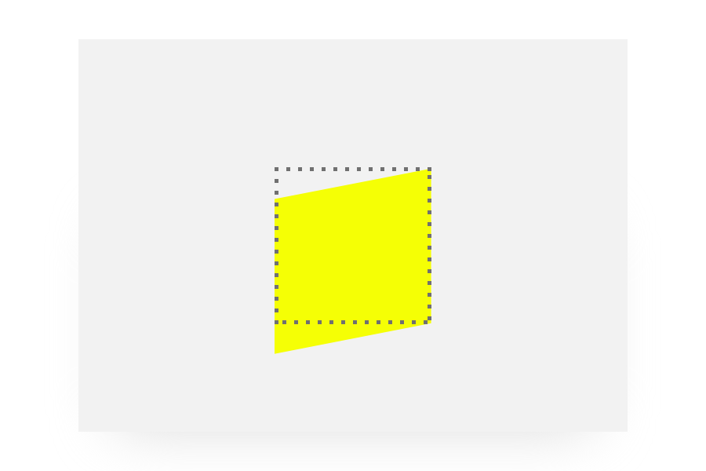

class: middle, center

# CSS Transforms

---

# CSS Transform

####The **CSS Transform** property lets you modify the coordinate space of the CSS visual formatting model. Using it, elements can be translated, rotated, scaled, and skewed. 

If the property has a value different than none, a stacking context will be created. In that case the object will act as a containing block for position: fixed elements that it contains.

Two major properties are used to define CSS transforms: transform and transform-origin.

**transform-origin**

Specifies the position of the origin. By default it is at the center of the element and can be moved. It is used by several transforms, like rotations, scaling or skewing, that need a specific point as a parameter.

**transform**

Specifies the transforms to apply to the element. It is a space separated list of transforms, which are applied one after the other, as requested by the composition operation.


---

##Transform values

**scale()**: affects the size of the element. This also applies to the font-size, padding, height, and width of an element, too. It’s also a a shorthand function for the scaleX and scaleY functions.

**skewX()** and **skewY()**: tilts an element to the left or right, like turning a rectangle into a parallelogram. There is no shorthand skew property.


**translate()**: moves an element sideways or up and down.

**rotate()**: rotates the element clockwise from its current position.

**matrix()**: a function that is probably not intended to be written by hand, but combines all transforms into one.

**perspective()**: doesn’t affect the element itself, but affects the transforms of descendent elements' 3D transforms, allowing them all to have a consistent depth perspective.

---

### Transform values

**scaleX(2)**

Scale the element on the horizontal axis.

.half[]


---

### Transform values

**scaleY(.5)**

Scale the element on the vertical axis.

.half[]

---

### Transform values

**scale(.5, .5)**

You can use scale() with two values:

* the first value is for the horizontal axis
* the second value is for the vertical axis

By using the same value for both, you can scale proportionally.


.half[]

---
### Transform values

**skewX(15deg)**

Skew the element on the horizontal axis.

.half[]

---
### Transform values

**skewY(15deg)**

Skew the element on the vertical axis.

.half[]

---

### Transform values

**translateX(50px)**

Move the element on the horizontal axis.

.half[]

---

### Transform values

**translateY(100%)**

Move the element on the vertical axis.

.half[]

You can use percentage values: the percentage is relative to the element itself, and not the parent.

---

### Transform values

**translate(20px, -10%)**

You can use translate() with two values:

* the first value is for the horizontal axis
* the second value is for the vertical axis

.half[]

---
### Transform values

**rotate(45deg)**

Rotate the element.

.half[]

You can use: **degrees** from 0 to 360deg, **gradians** from 0 to 400grad, **radians** from 0 to 2πrad, **turns** from 0 to 1turn

---
 
### Transform values

**none**

Removes any transformation.

.half[]

---

##Transform syntax

```css
transform: matrix(1.0, 2.0, 3.0, 4.0, 5.0, 6.0);
transform: translate(12px, 50%);
transform: translateX(2em);
transform: scale(2, 0.5);
transform: scaleX(2);
transform: rotate(0.5turn);
transform: skew(30deg, 20deg);
transform: skewX(30deg);
transform: skewY(1.07rad);
transform: translate3d(12px, 50%, 3em);
transform: translateZ(2px);
transform: none;

/* Multiple function values */
transform: translateX(10px) rotate(10deg);
```

---

### Transform properties

**transform-origin**
      
The transform-origin property lets you modify the origin for transformations of an element. For example, the transform-origin of the rotate() function is the centre of rotation. (This property is applied by first translating the element by the negated value of the property, then applying the element's transform, then translating by the property value.)

Not explicitly set values are reset to their corresponding values.

```css
/* x-offset y-offset */
transform-origin: 3px 2px;

/* x-offset-keyword y-offset */
transform-origin: left 2px;

/* x-offset y-offset z-offset */
transform-origin: 2px 30% 10px;
```

---

### Transform properties

**backface-visibility**

The CSS backface-visibility property determines whether or not the back face of the element is visible when facing the user. The back face of an element is always a transparent background, letting, when visible, a mirror image of the front face be displayed.

There are cases when we do not want the front face of an element to be visible through the back face, like when doing a flipping card effect (setting two elements side-to-side).

This property has no effect on 2D transforms as there is no perspective.

```css
backface-visibility: visible;
backface-visibility: hidden;
```

---

### Transform properties

**perspective**

The perspective CSS property determines the distance between the z=0 plane and the user in order to give to the 3D-positioned element some perspective. Each 3D element with z larger than 0 becomes larger; each 3D-element with z smaller than 0 becomes smaller. The strength of the effect is determined by the value of this property.

Part of the 3D-elements that are behind the user, i.e. that their z-axis coordinate is greater than the value of the perspective CSS property are not drawn.

The vanishing point is by default placed at the center of the element, but its position can be changed using the perspective-origin property.

Using this property with a value different than 0 and none creates a new stacking context.

```css
perspective: 20px;  
```

---

### Transform properties

**perspective-origin**

The perspective-origin CSS property determines the position the viewer is looking at. It is used as the vanishing point by the perspective property.

```css
/* one-value syntax */
perspective-origin: x-position;

/* two-value syntax */
perspective-origin: x-position y-position; 
```

---

### Transform properties

**transform-style**

The transform-style CSS property determines if the children of the element are positioned in the 3D-space or are flattened in the plane of the element.

If flattened, the children will not exist on their own in the 3D-space.

As this property is not inherited, it must be set for all non-leaf descendants of the element.

```css  
/* Keyword values */
transform-style: preserve-3d;
transform-style: flat;
```


**preserve-3d**

Indicates that the children of the element should be positioned in the 3D-space.

**flat**

Indicates that the children of the element are lying in the plane of the element itself. 

---

###Resources
      
- [Using CSS transforms](https://developer.mozilla.org/en-US/docs/Web/CSS/CSS_Transforms/Using_CSS_transforms)
- [CSS transform](https://developer.mozilla.org/en-US/docs/Web/CSS/transform)
- [Transform](https://css-tricks.com/almanac/properties/t/transform/)
- [An Introduction to CSS 3-D Transforms](https://24ways.org/2010/intro-to-css-3d-transforms/)
- [The Matrix Resolutions](http://meyerweb.com/eric/tools/matrix/)
